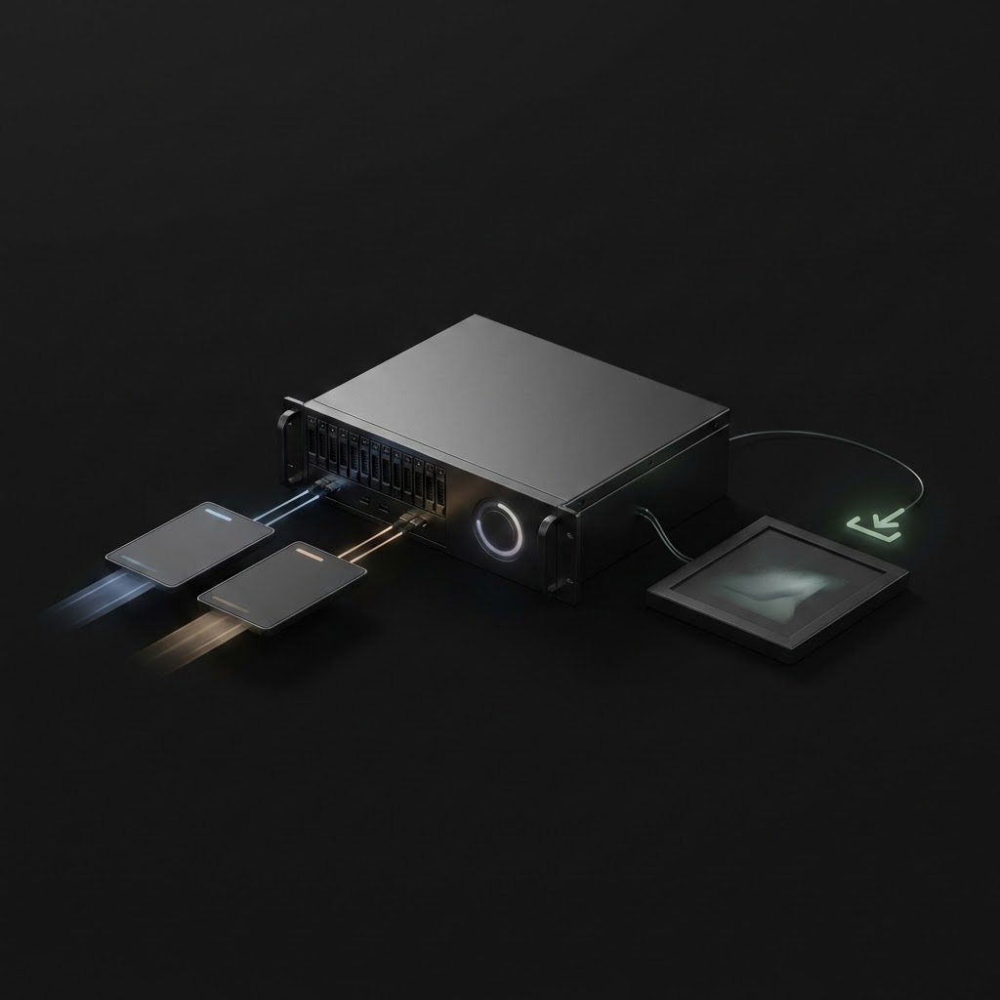

# Kie AI MCP Server

MCP server that bridges to the Kie AI image generation API. Creates tasks, polls for completion, and saves the resulting image to disk. Works with any prompt and style.

**Author:** [roxl.net](https://roxl.net)

## Example


## What It Does
- Creates image generation tasks via Kie AI
- Polls task status until completion (or returns a task id for async flows)
- Downloads the resulting image and writes it to disk
- Supports parallel batch generation with explicit style/prompt per item

## Quick Start

```bash
# Build
make build

# Copy env template and add your API key
cp .env.example .env
# edit .env — set KIE_AI_API_KEY

# Run
./bin/kie-ai-mcp
```

## Environment Variables

| Variable | Required | Default | Description |
|---|---|---|---|
| `KIE_AI_API_KEY` | **yes** | — | Your [Kie AI](https://kie.ai) API key |
| `KIE_AI_BASE_URL` | no | `https://api.kie.ai/api/v1` | API base URL |
| `KIE_AI_MODEL` | no | `nano-banana-pro` | Image generation model |
| `KIE_AI_OUTPUT_DIR` | no | `output` | Directory where generated images are saved |
| `KIE_AI_TIMEOUT_SECONDS` | no | `90` | Per-request HTTP timeout |
| `KIE_AI_POLL_INTERVAL_SECONDS` | no | `3` | Seconds between task status polls |
| `KIE_AI_POLL_TIMEOUT_SECONDS` | no | `300` | Max seconds to wait for a task to complete |
| `KIE_AI_HTTP_RETRIES` | no | `3` | Retry attempts on transient HTTP errors |
| `KIE_AI_HTTP_RETRY_BACKOFF_SECONDS` | no | `1.5` | Initial backoff delay for retries (doubles each attempt) |

Copy `.env.example` to `.env` and fill in `KIE_AI_API_KEY` at minimum.

### Fish Shell (global, no .env file)

Set variables as universal fish vars so they persist across sessions and are available to any process:

```fish
set -Ux KIE_AI_API_KEY your-api-key-here
set -Ux KIE_AI_BASE_URL https://api.kie.ai/api/v1
set -Ux KIE_AI_MODEL nano-banana-pro
set -Ux KIE_AI_OUTPUT_DIR output
set -Ux KIE_AI_TIMEOUT_SECONDS 90
set -Ux KIE_AI_POLL_INTERVAL_SECONDS 3
set -Ux KIE_AI_POLL_TIMEOUT_SECONDS 300
set -Ux KIE_AI_HTTP_RETRIES 3
set -Ux KIE_AI_HTTP_RETRY_BACKOFF_SECONDS 1.5
```

`-U` makes the variable universal (persists across sessions), `-x` exports it to child processes. No `.env` file needed.

### MCP Host Config (recommended for distribution)

Pass the key via the MCP host's `env` block — the key lives outside the repo and never appears in tool messages or logs.

**Claude Desktop** (`~/Library/Application Support/Claude/claude_desktop_config.json`):

```json
{
  "mcpServers": {
    "kie-ai-mcp": {
      "command": "/path/to/kie-ai-mcp",
      "env": {
        "KIE_AI_API_KEY": "your-key-here"
      }
    }
  }
}
```

**Claude Code** (`.claude/mcp_servers.json` or `~/.claude/mcp_servers.json`):

```json
{
  "kie-ai-mcp": {
    "command": "/path/to/kie-ai-mcp",
    "env": {
      "KIE_AI_API_KEY": "your-key-here"
    }
  }
}
```

No `.env` file needed. Optional variables (`KIE_AI_MODEL`, `KIE_AI_OUTPUT_DIR`, etc.) can be added to the same `env` block.

## MCP Tools
- `describe_imager_interface` — Returns tool contracts and environment info.
- `create_visual_task` — Creates a task and returns `task_id`.
- `get_visual_task` — Fetches task status by `task_id`.
- `generate_visual` — Creates a task and waits for the resulting image.
- `generate_visual_batch` — Runs multiple generations in parallel (`items[]`, `default_style`, `max_workers`, per-item outputs/errors).

## Notes
- The server reads `.env` from the working directory or from the directory containing the binary.
- Images are saved to `KIE_AI_OUTPUT_DIR` unless `output_path` is passed per-call.
- Do not commit your `.env`.

## References
- API details: `references/kie-api.md`
